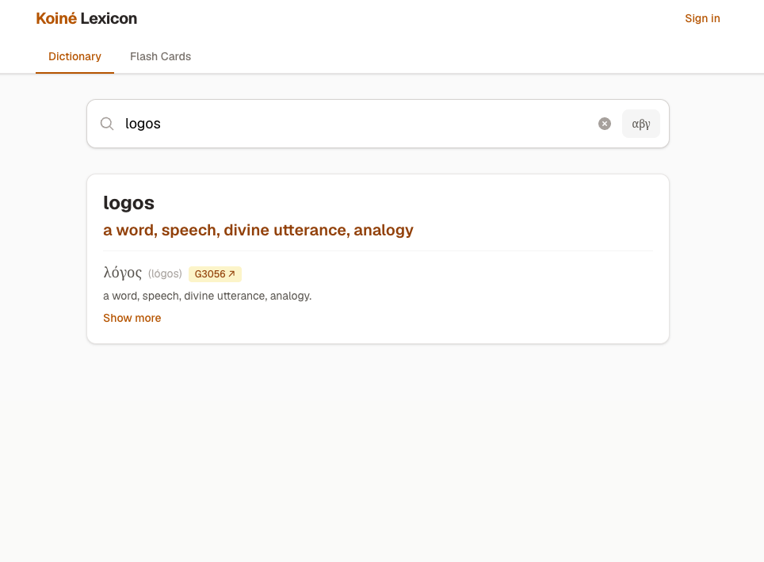

# Koine Greek Search and Learn

  

This is a web application used to search all Koine Greek terms that appear in the NT, with 80% lexicon definitions from Dodson's Lexicon, with the remainder from Strong's Concordance. Using transliteration via english characters or using the build-in koine greek keyboard, you can search for all root or whole words and quickly get their definition, understand context or root, and link to strong's for more information. 

## Flash Card System
In looking up if there is a common word that you see yourself looking up often and want to bookmark it for further study. There is a flashcard feature for this. After creating an account and signing in you can then have a database of flashcards that you can bookmark from the main search and use for later to study with. Or create your own custom flash cards too. 

# DEMO
You can check out my running version here:

[Koine Greek Search Demo](https://koine-search.casteel.pw)

# Deployment
This app is containerized, you can see the #docker-compose.yml for more information, as a demo, but it's very simple. It runs on port 3000, and for now the db/auth backend is all local.